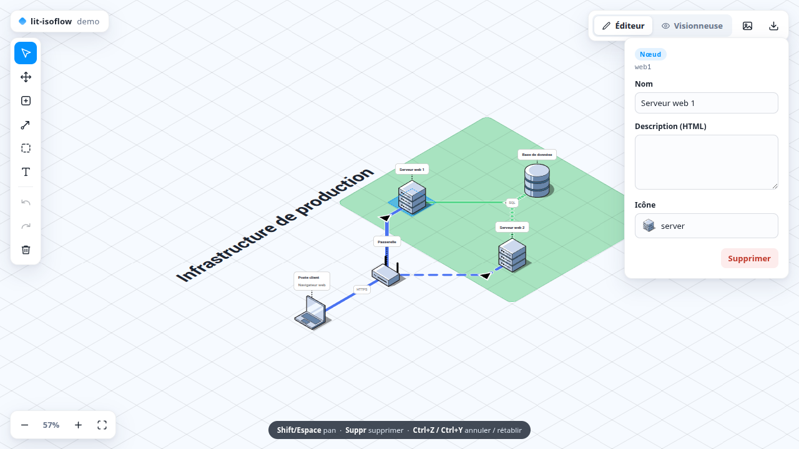

# lit-isoflow

[](https://github.com/eviltik/lit-isoflow/actions/workflows/ci.yml)
[](https://www.npmjs.com/package/lit-isoflow)
[](LICENSE)
[](package.json)

**Viewer and editor for isometric infrastructure diagrams**, as a single Lit
web component — a React-free port of
[Isoflow](https://github.com/markmanx/isoflow) / FossFLOW.

The model format (JSON) is interchangeable with Isoflow/FossFLOW exports: diagrams
created there render here, and vice versa.

### ▶ [Try the live demos](https://eviltik.github.io/lit-isoflow/)

Two of them: the [editor](https://eviltik.github.io/lit-isoflow/editor/) (the full
component) and a [stress test](https://eviltik.github.io/lit-isoflow/stress/) (up
to 10 000 nodes, with the numbers).

[](https://eviltik.github.io/lit-isoflow/)

## Why

The upstream Isoflow is an excellent piece of work, but it is a React application:
React, MUI, zustand, immer, gsap, chroma-js, react-quill — over 1 MB of
dependencies before your own code. If your app is not a React app, you cannot
embed it.

`lit-isoflow` keeps the parts that matter — the isometric projection, the A\*
connector routing, the model format — and rewrites the view layer as a standard
web component. Three runtime dependencies (`lit`, `zod`, `pathfinding`), roughly
140 kB bundled, and it drops into any framework, or none.

## One component, three modes

The `editor-mode` attribute selects what `<lit-isoflow>` is:

| Mode                              | What you get                                                                            | Typical use                                             |
| --------------------------------- | --------------------------------------------------------------------------------------- | ------------------------------------------------------- |
| `EXPLORABLE_READONLY` _(default)_ | **Viewer** — pan, zoom, fit-to-view; the model is never mutated                         | embedding a diagram in docs, dashboards, read-only apps |
| `EDITABLE`                        | **Editor** — everything below: tools, selection, drag, drawing, undo/redo, property API | diagram authoring UI                                    |
| `NON_INTERACTIVE`                 | **Static rendering** — no listeners at all                                              | screenshots, PDF/PNG export pipelines, thumbnails       |

```html
<!-- Viewer -->
<lit-isoflow fit-to-view></lit-isoflow>

<!-- Editor -->
<lit-isoflow editor-mode="EDITABLE" fit-to-view></lit-isoflow>
```

Editing capabilities (`EDITABLE`): select & drag items, rubber-band selection
(drag on empty canvas to select a group, then move it as one; Shift adds to the
selection — click or band), draw connectors
(anchored to items or tiles), re-anchor or bend connectors by dragging their
anchors/path, draw & resize rectangles, place icons, add text boxes, delete
selection, gesture-level undo/redo, transient pan (hold Ctrl/Space).
Property panels (name, color, description…) are provided by the host app —
see “Wiring a property panel”.

Rendering (all modes): grid, nodes (isometric & flat icons), connectors
(A* routing, solid/dashed/dotted, direction arrows, labels), rectangles,
text boxes, node labels.

## Install

```bash
npm install lit-isoflow
```

## Usage

```html
<lit-isoflow fit-to-view style="width: 100%; height: 600px"></lit-isoflow>

<script type="module">
  import 'lit-isoflow';

  const diagram = document.querySelector('lit-isoflow');
  diagram.model = {
    title: 'My diagram',
    icons: [{ id: 'server', name: 'Server', url: '...', isIsometric: true }],
    colors: [{ id: 'blue', value: '#a5b8f3' }],
    items: [{ id: 'srv1', name: 'Server 1', icon: 'server' }],
    views: [
      {
        id: 'main',
        name: 'Main view',
        items: [{ id: 'srv1', tile: { x: 0, y: 0 } }],
        connectors: [],
        rectangles: [],
        textBoxes: []
      }
    ]
  };
</script>
```

Putting it into a real app — bundling, icon packs, saving, theming, rendering
diagrams into PDFs and Word files — is covered in the
**[integration guide](docs/integration.md)**.

### Properties / attributes

| Property          | Attribute          | Default               | Description                                                          |
| ----------------- | ------------------ | --------------------- | -------------------------------------------------------------------- |
| `model`           | —                  | `null`                | Diagram model (Isoflow/FossFLOW JSON)                                |
| `viewId`          | `view-id`          | first view            | View to display                                                      |
| `editorMode`      | `editor-mode`      | `EXPLORABLE_READONLY` | `EDITABLE`, `EXPLORABLE_READONLY` (pan/zoom) or `NON_INTERACTIVE`    |
| `showGrid`        | `show-grid`        | `true`                | Show the isometric grid                                              |
| `theme`           | `theme`            | `auto`                | `light`, `dark`, or `auto` (follows the OS) — see Theming            |
| `backgroundColor` | `background-color` | —                     | Overrides the theme's background                                     |
| `fitToView`       | `fit-to-view`      | `false`               | Fit the view in the viewport on load                                 |
| `strings`         | —                  | English               | Overrides for the component's two strings — see Internationalisation |

### Methods

- `zoomIn()` / `zoomOut()` — multiplicative steps (×1.25), from 0.01 to 4. The
  floor is that low on purpose: a diagram of several thousand nodes only fits on
  screen at a few percent.
- `fit()` — fit the whole view inside the viewport, measured on what is actually
  painted (icons, labels, connector paths) rather than the tile bounding box,
  which overestimates by roughly 3×
- `setTool(tool, options?)` — activate an editing tool: `'CURSOR'`, `'PAN'`,
  `'PLACE_ICON'` (`options.iconId`), `'CONNECTOR'`, `'RECTANGLE'`, `'TEXTBOX'`
- `tool` (getter) — currently active tool
- `deleteSelection()` — delete the selected item (also bound to the Delete key)
- `clearSelection()` — clear the selection (also bound to Escape); the host can
  use it to close its property panel
- `undo()` / `redo()` — gesture-level history (also bound to Ctrl+Z / Ctrl+Y /
  Ctrl+Shift+Z); `canUndo` / `canRedo` getters
- `getModel()` — deep snapshot of the current (possibly edited) model
- `getSelectedItem()` / `updateItem()` / `updateViewItem()` / `updateConnector()`
  / `updateRectangle()` / `updateTextBox()` — property-panel API, see
  “Wiring a property panel” below
- `getSelectedItems()` — the rubber-band selection, as `[{ type, id }]` (or
  `null`). Exclusive with `getSelectedItem()`: a group has no property panel,
  a plain click on a member collapses the group to that single element
- `createRectangle({ from, to, color?, id? })` / `deleteRectangle(id)` — place a
  zone programmatically (importing, templating, generating), rather than only by
  drawing it with the mouse. Returns the new id.
- `exportSvg(options?)` — renders the view to **vector SVG**. Returns
  `{ svg, width, height }`. Options: `showGrid` (default false), `background`
  (default `'transparent'`), `margin` (default 0.15 tiles). A thin wrapper around
  `renderToSvg()` — see “Rendering without a browser”.
- `exportPng(options?)` — renders the view to a PNG with no extra dependency
  (off-screen clone → SVG `foreignObject` → canvas), cropped tightly to the
  rendered content (icons, labels, connectors — not the tile bounding box).
  Returns `{ blob, dataUrl, width, height }`. Options: `scale` (default 2),
  `showGrid` (default false), `background` (any CSS color, including
  `'transparent'`), `margin` (tiles around the content, default 0.15).
  Icon URLs must be data URIs or same-origin (external images would taint
  the canvas); isopack icons are data URIs, so they just work.

### Keyboard (EDITABLE)

| Key                           | Action                                                      |
| ----------------------------- | ----------------------------------------------------------- |
| Hold **Ctrl** or **Space**    | Pan; the active tool and selection are restored on release  |
| **Shift+click**               | Add an element to the selection, or remove it (toggle)      |
| **Shift+drag** (empty canvas) | Rubber band that adds to the selection instead of replacing |
| **Delete** / **Backspace**    | Delete the selection                                        |
| **Escape**                    | Clear the selection                                         |
| **Ctrl+Z**                    | Undo                                                        |
| **Ctrl+Y** / **Ctrl+Shift+Z** | Redo                                                        |

Shortcuts are ignored while typing in an input, including inside a shadow root.

### Events

- `diagram-ready` — model parsed and scene rendered
- `zoom-changed` — `detail.zoom`
- `model-error` — `detail.error` (zod validation error)
- `item-selected` — `detail.item` (`{ type, id }` or `null`)
- `selection-changed` — `detail.items` (rubber-band selection, `[{ type, id }]` or `null`)
- `model-updated` — `detail.model` (debounced snapshot after each edit)
- `tool-changed` — `detail.tool`
- `history-changed` — `detail.canUndo` / `detail.canRedo`

### Wiring a property panel / rich text editor

`<lit-isoflow>` deliberately ships **no property panel and no rich text
editor**: the canvas stays lean (lit + zod + pathfinding) and the host app
brings its own UI kit. The wiring contract is three parts:

1. **Listen to `item-selected`**, then call `getSelectedItem()` for the full
   data of the selection:

   ```js
   diagram.addEventListener('item-selected', () => {
     const selected = diagram.getSelectedItem();
     // ITEM      → { type, id, modelItem: { name, description, icon }, viewItem: { tile, labelHeight } }
     // CONNECTOR → { type, id, connector: { description, color, style, width, anchors } }
     // RECTANGLE → { type, id, rectangle: { color, from, to } }
     // TEXTBOX   → { type, id, textBox: { content, fontSize, orientation, tile } }
     renderMyPanel(selected); // null when the selection is cleared
   });
   ```

2. **Write changes back** through the update methods — each call re-renders
   the scene, feeds the undo history and emits `model-updated`:

   ```js
   diagram.updateItem(id, { name, description, icon });
   diagram.updateViewItem(id, { tile, labelHeight });
   diagram.updateConnector(id, { description, color, style, width });
   diagram.updateRectangle(id, { color });
   diagram.updateTextBox(id, { content, fontSize, orientation });
   ```

3. **Persist** by listening to `model-updated` (debounced) or calling
   `getModel()` whenever you save.

The editor demo ([demo/editor/index.html](demo/editor/index.html)) implements a
complete panel with plain HTML inputs — no dependency — and is the reference
example.

**Rich descriptions:** `modelItem.description` is an **HTML string**
(≤ 1000 chars; upstream Isoflow edits it with Quill and uses `<p><br></p>` as
its empty value). Any editor that produces HTML plugs in. With tiptap:

```js
import { Editor } from '@tiptap/core';
import StarterKit from '@tiptap/starter-kit';

let editor;
diagram.addEventListener('item-selected', () => {
  const selected = diagram.getSelectedItem();
  editor?.destroy();
  if (selected?.type !== 'ITEM') return;

  editor = new Editor({
    element: document.querySelector('#description-editor'),
    extensions: [StarterKit],
    content: selected.modelItem.description ?? '',
    onUpdate: ({ editor }) => {
      diagram.updateItem(selected.id, { description: editor.getHTML() });
    }
  });
});
```

Notes:

- Each keystroke burst (pauses < 250 ms) collapses into one undo step; debounce
  `onUpdate` yourself if you want coarser steps.
- Descriptions are rendered as-is in node labels — sanitize if models come from
  untrusted sources.

### Icons

Icons are plain image URLs (SVG/PNG, data URIs welcome), declared in `model.icons`.
`isIsometric: true` renders the image as-is (pre-projected isometric artwork);
`isIsometric: false` projects a flat image onto the isometric ground plane.

The official icon packs work unchanged — the demo loads all five
[@isoflow/isopacks](https://www.npmjs.com/package/@isoflow/isopacks)
(Isoflow basic, AWS, Azure, GCP, Kubernetes — 1000+ icons) and exposes them in
a searchable gallery:

```js
import isoflowIsopack from '@isoflow/isopacks/dist/isoflow';

const icons = isoflowIsopack.icons.map((icon) => ({ ...icon, collection: 'Isoflow' }));
diagram.model = { ...model, icons };
```

Icon artwork belongs to its respective owners (AWS, Microsoft, Google, CNCF,
Isoflow); check the isopacks repository for per-collection licences. That is
why `@isoflow/isopacks` is a dev-dependency of the demo, not a dependency of
this package.

### Theming (light / dark)

```html
<lit-isoflow theme="dark"></lit-isoflow>
<!-- light | dark | auto -->
```

`auto` (the default) follows the OS via `prefers-color-scheme` and repaints when
it changes. In an app that has its own theme toggle, drive the property instead —
`auto` would ignore it:

```js
diagram.theme = app.isDark ? 'dark' : 'light';
```

**The theme only repaints the chrome** — background, grid, label boxes, leader
lines, connector halos, controls. Node, connector and zone colours come from
`model.colors`: they belong to the diagram, not to the interface, and a diagram
that means something in red still means it at night.

The same applies to the headless renderer, which defaults to `light` — an export
is a document, not a screen, so it must not depend on the machine that generated it:

```js
renderToSvg(model, { theme: 'dark' });
```

Both worlds read the same palettes ([src/theme.js](src/theme.js)), so the canvas
and the exported SVG cannot drift apart.

### Rendering without a browser

The SVG renderer is **pure JavaScript with no DOM**, so a diagram can be turned
into vector output anywhere JavaScript runs — a CLI, a build step, a server, a
PDF pipeline:

```js
import { renderToSvg } from 'lit-isoflow/render'; // no lit, no DOM

const { svg, width, height } = renderToSvg(model, {
  theme: 'light', // 'light' (default) or 'dark'
  background: '#ffffff', // overrides the theme's background; 'transparent' by default
  showGrid: false,
  margin: 0.5 // tiles of padding around the content
});
```

This entry point pulls in neither Lit nor the component, so it stays light in a
Node process. It shares the geometry engine with `<lit-isoflow>` — the component's
`exportSvg()` is exactly this function — so what you get is what the editor shows.

Notes:

- Node descriptions (HTML) are flattened to plain text, since SVG has no rich text.
- Text width is measured with a canvas in the browser, and estimated from font
  metrics in Node, so text-box layouts can differ by a pixel or two.
- Icon aspect ratios are read from their data-URI `viewBox`. For raster icons,
  pass `iconSizes: { [iconId]: { width, height } }`.

### Internationalisation

The component is a canvas: it owns exactly **two** user-facing strings, so there
is no i18n layer to configure — just override them:

```js
diagram.strings = {
  untitledItem: 'Sans titre', // name given to a newly placed node
  invalidModel: 'Modèle invalide' // prefix of the model validation error
};
```

Everything else on screen comes from your model (node names, labels) or from your
own UI. The demo ships a ~40-line, dependency-free i18n module
([demo/shared/i18n.js](demo/shared/i18n.js)) — dictionary per language, `t()`
helper, browser detection, `localStorage` persistence — as a reference for host
apps.

## Performance

Nodes are real DOM subtrees (roughly nine elements each, three without a label),
which buys hit-testing, CSS, and accessibility — and sets a ceiling. Two things
keep that ceiling far away:

- **Off-screen nodes are not mounted.** Only what the viewport shows is in the
  DOM.
- **A node's template is rebuilt only when that node changed.** Its rendering
  depends on exactly four things — view item, model item, resolved icon, theme —
  and mutations replace those objects rather than editing them in place, so
  identity is a sound change signal.

Together, they make interaction **independent of model size**. Measured with the
[stress demo](https://eviltik.github.io/lit-isoflow/stress/) at the working zoom,
1 000 and 10 000 nodes both hold ~60 fps while panning and under live mutation
(~3 000 icon swaps per second).

The honest limit: **zoom all the way out to fit a huge diagram and every node is
on screen, so every node is mounted.** Reconciling 10 000 live DOM subtrees costs
~120 ms per frame no matter how little has changed — around 2 fps. If you need to
fly over diagrams that big, this is the wall, and the answer is level-of-detail
(paint a dot, not a subtree, when an icon is 7 px wide), not a faster renderer.

Run the numbers yourself: the stress demo generates up to 10 000 nodes and reports
first render, DOM size, and frame rate — including the bad ones.

## Security

Node `description` fields hold **HTML** (that is what Isoflow's rich text editor
produces) and are rendered as-is inside node labels. Sanitize them if your models
come from untrusted sources.

## Development

```bash
git clone https://github.com/eviltik/lit-isoflow
cd lit-isoflow
pnpm install
pnpm run demo     # the demo doubles as the manual test bench
pnpm run check    # lint + formatting + unit tests
```

There is no build step: `src/` is plain ES modules with JSDoc types, and that is
what gets published. See [CONTRIBUTING.md](CONTRIBUTING.md).

## Design notes / deviations from Isoflow

- **No React, MUI, zustand, immer, gsap, chroma-js or dom-to-image.** The geometry
  engine (projection, A\* connector routing, fit-to-view) is ported as-is; the view
  layer is rewritten with Lit templates, animations use CSS transitions, colour
  variants use an HSL approximation of chroma's brighten/darken, and PNG export
  goes through an SVG `foreignObject`.
- The scene (connector paths, textbox sizes) is derived from the model as a pure
  function (`deriveScene`) instead of being kept in sync inside a store.
- Selected-connector anchors render above the nodes layer and take hit-test
  priority, so endpoints sitting on a node can be grabbed and re-anchored
  (upstream hides them behind nodes and always drags the node).
- Gesture-level undo/redo — absent upstream.
- Invalid connectors are skipped rather than deleted from the model.
- The rubber-band selection is lit-isoflow's own, not a port: upstream's Lasso
  mode is entirely commented out. It works in tile space — the projected
  parallelogram you see is exactly what is captured.

## Credits

This is a port, and the hard thinking — the isometric projection, the connector
routing, the model format, the icon packs — comes from the original work:

- [Isoflow](https://github.com/markmanx/isoflow) by Mark Mankarious (MIT)
- [FossFLOW](https://github.com/stan-smith/FossFLOW) by Stan Smith (MIT), which
  keeps the community edition alive
- [@isoflow/isopacks](https://www.npmjs.com/package/@isoflow/isopacks) for the icons

## Licence

MIT — see [LICENSE](LICENSE). Portions derived from Isoflow (MIT) and FossFLOW
(MIT). Icon artwork in the demo belongs to its respective owners.
